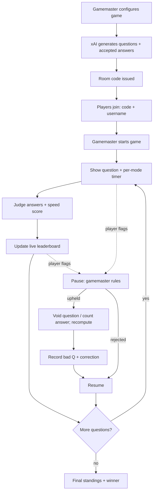
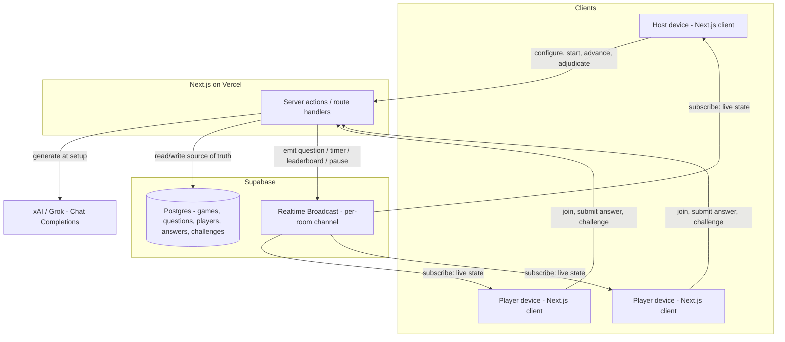
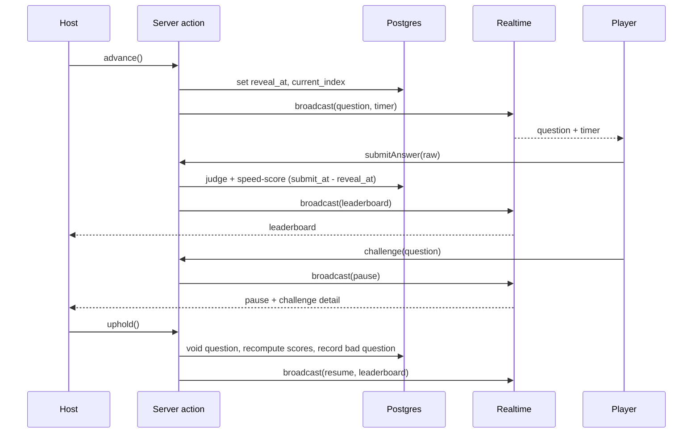

# AI Trivia Game - Plan

## Goal Capsule

- **Objective:** Ship a live, Kahoot-style multiplayer trivia web app where the gamemaster configures a game (categories, count, answer mode, difficulty), xAI generates the question set, and players join by room code on their own devices for a real-time, speed-scored round with a pause-to-adjudicate challenge mechanism.
- **Product authority:** The project owner owns product decisions. In-game, the gamemaster is the final arbiter of question correctness and answer judging.
- **Execution profile:** Deep, greenfield, phased delivery (Foundation → Generation & entry → Live play → Fairness & results). Stack is fixed by the owner's existing setup (see Key Technical Decisions).
- **Stop conditions:** Stop and confirm on any change to product scope or a contradiction with the Product Contract. Surface a genuine blocker rather than guessing.
- **Open blockers:** None. Remaining unknowns are non-blocking and listed under Open Questions.
- **Product Contract preservation:** changed — added R16 (difficulty selection) per owner request; clarified Actor A3 and the xAI dependency to remove the "AI assists adjudication" claim (the gamemaster is sole arbiter, per KTD5). R1–R15 unchanged.

---

## Product Contract

### Summary

A real-time multiplayer trivia web app for small party groups. The gamemaster configures a game and xAI generates the question set; players join by room code and answer live on a speed-scored leaderboard. The differentiator from Kahoot is AI-generated questions, and the answer to AI's correctness risk is a live, player-driven challenge mechanism with the gamemaster as final arbiter.

### Problem Frame

Live group trivia today (Kahoot and similar) requires someone to author or source every question by hand — the bottleneck that makes a spontaneous game hard to spin up. Generating questions with AI removes that bottleneck, but introduces a new risk: models confidently produce wrong "correct" answers, ambiguous phrasing, or answers that won't match what a player types. In a casual party that is a shrug; in a *scored, competitive* game it is a fairness problem that erodes trust in the whole app. The product's core challenge is to keep AI generation's speed while protecting competitive fairness.

### Key Decisions

- **Trust the AI up front; no mandatory review screen.** On submit, the full question set generates and the room code issues immediately. The live challenge flag is the quality gate, so the host gets playing fast rather than vetting every question. An optional pre-game review screen is deferred, not designed in.
- **Crowd-sourced fairness via challenge + adjudication.** Correctness is policed at runtime by the players who notice errors, with the gamemaster ruling. This is the product's answer to AI correctness risk, chosen over pre-game vetting because the errors that matter are the ones real players catch.
- **Challenges pause-and-resolve live.** A challenge halts play for an immediate ruling; upheld challenges void the question and recompute scores before resuming. Immediate fairness is prioritized over uninterrupted pace.
- **Speed-based scoring with per-mode timers.** Correct-and-fast earns more, keeping the leaderboard tense — but type-the-answer gets a longer timer and gentler decay so the harder mode is not penalized for being slower.
- **Type-the-answer solutions are capped to one or two easy-to-spell words.** This generation constraint makes instant fuzzy matching reliable, avoiding slow per-answer AI grading; the host override handles the rare miss.
- **"The AI learns" stays lightweight.** Confirmed-bad questions are recorded with their corrections so they are not reused and can seed future generation. No per-game model training.

### Actors

- A1. **Gamemaster** — configures and starts the game, drives pace, adjudicates challenges, and is the final arbiter of correctness; may host-only (see Open Questions).
- A2. **Player** — joins by room code and username, answers each question on their own device, and may raise challenges.
- A3. **AI question generator** (xAI/Grok) — produces the question set and accepted-answer variants, enforces the type-the-answer word constraint and the chosen difficulty. It is not consulted during live play; the gamemaster is the sole adjudicator of challenges (KTD5).

### Key Flows

- F1. **Setup and launch**
  - **Trigger:** Gamemaster opens the app's landing page.
  - **Steps:** Picks categories from a list; sets question count; chooses answer mode; chooses difficulty; submits. xAI generates the question set and accepted-answer variants; a room code is issued.
  - **Outcome:** A joinable game exists with a shareable code.
  - **Covered by:** R1, R2, R3, R4, R16.
- F2. **Join**
  - **Trigger:** Player opens the landing page with a code in hand.
  - **Steps:** Enters room code and a username; lands in the lobby.
  - **Outcome:** Player is registered to the game on their own device.
  - **Covered by:** R5.
- F3. **Question round**
  - **Trigger:** Gamemaster starts the game (or advances to the next question).
  - **Steps:** All players see the same question with a per-mode timer; each submits; answers are judged instantly; scores update; the leaderboard refreshes.
  - **Outcome:** Round scored, standings updated.
  - **Covered by:** R6, R7, R8, R9.
- F4. **Challenge and adjudication**
  - **Trigger:** A player flags a challenge on the current question.
  - **Steps:** Play pauses; the gamemaster sees the challenge (and, for a disputed answer, the player's submitted text) and rules uphold/reject; on uphold, the question is voided and scores recompute, or the disputed answer is counted correct; play resumes.
  - **Outcome:** The disputed outcome is corrected; the bad question (if any) is recorded for future generation.
  - **Covered by:** R10, R11, R12, R13, R14.
- F5. **Results**
  - **Trigger:** The final question is scored.
  - **Steps:** Final standings compute; the winner is revealed.
  - **Outcome:** Game ends; no state persists.
  - **Covered by:** R15.

### Requirements

**Setup and generation**

- R1. The gamemaster configures a game from the landing page: selects one or more categories from a provided list, sets the number of questions, and chooses an answer mode (multiple-choice or type-the-answer).
- R2. On submission, the system generates the full question set with xAI for the chosen categories and count, then issues a unique room code; no mandatory human review precedes code issuance.
- R3. For type-the-answer questions, generation constrains each answer to one or two common, easy-to-spell words; a candidate question whose natural answer cannot meet this constraint is not used in that mode.
- R4. Each generated question carries a set of accepted answer variants used for automated judging.
- R16. The gamemaster selects a difficulty — easy, medium, or hard — during setup, and generation produces questions calibrated to that level.

**Joining and live play**

- R5. A player joins from their own device by entering the room code and a username on the landing page; no account is required.
- R6. The gamemaster starts and paces the game; all players see each question simultaneously and answer within a per-question time limit.
- R7. Scoring is speed-based — a correct answer earns base points plus a time bonus — with separate timers and decay per answer mode so type-the-answer is not penalized for being inherently slower.
- R8. A live leaderboard reflects standings and updates between questions.
- R9. Multiple-choice answers are scored by exact option match; type-the-answer responses are judged instantly against the question's accepted variants by normalized/fuzzy match.

**Fairness: challenge and adjudication**

- R10. Any player can raise a challenge on the active question — either that the question/answer is wrong, or that their own answer was wrongly marked incorrect.
- R11. A challenge pauses the game; the gamemaster sees the challenge and, for a disputed answer, the player's submitted text, and rules to uphold or reject.
- R12. On an upheld question challenge, the question is voided and affected scores recompute before play resumes; on an upheld disputed-answer challenge, the gamemaster counts that answer correct. The gamemaster's ruling is final.
- R13. A lightweight guard limits challenge abuse so one player cannot indefinitely stall the game.
- R14. A confirmed-bad question is recorded with its correction so it is not reused and can seed future generation, without model training.

**Results**

- R15. After the last question is scored, the game shows final standings and reveals the winner.

### Acceptance Examples

- AE1. **Covers R3, R9.** Given a type-the-answer question whose accepted variants include `kennedy` and `john kennedy`, when a player submits `kenedy`, then the fuzzy match counts it correct and awards the time-bonus score instantly.
- AE2. **Covers R7.** Given the same question shown in multiple-choice mode (shorter timer) and type-the-answer mode (longer timer), when two players answer correctly at the same fraction of their respective timers, then their time bonuses are comparable rather than the type-the-answer player being penalized.
- AE3. **Covers R11, R12.** Given a question already answered by all players and reflected on the leaderboard, when a player challenges it and the gamemaster upholds the challenge, then the question is voided, the leaderboard recomputes without it, and play resumes at the next question.
- AE4. **Covers R12.** Given a player marked wrong on a type-the-answer question they believe is correct, when they challenge and the gamemaster counts their answer correct, then their score updates to reflect the correct answer before play resumes.
- AE5. **Covers R13.** Given a player who has already raised the maximum allowed challenges, when they attempt another, then the guard prevents it from pausing the game.

### Scope Boundaries

**Deferred for later**

- Large-crowd / social scaling (100+ players) and the real-time infrastructure hardening it requires. Initial build targets ≤10-player party play.
- Content-safety hardening for public or unknown audiences (e.g., classroom- or public-grade filtering of AI questions).
- Accounts, persistence, game history, saved leaderboards, and rematch-with-the-same-players. Supabase Auth is deferred; v1 is anonymous.
- An optional pre-game question review/edit screen for the gamemaster.

**Outside this product's identity**

- Real per-game model fine-tuning or training. "The AI learns" is a lightweight blocklist-plus-corrective-example loop, not training.
- Human-authored question banks as the primary content source. AI generation is the point of the product.

### Dependencies / Assumptions

- An xAI/Grok account and API key are available for question generation.
- A Supabase project is provisioned with Realtime enabled and a Postgres database.
- Vercel hosts the Next.js app.
- Assumption: the initial target is ≤10 players in a party/hangout setting; design choices optimize for that scale.
- Assumption: play is ephemeral — no data persists beyond the live game except the lightweight bad-question record that feeds future generation.

---

## Planning Contract

### Key Technical Decisions

- KTD1. **Next.js on Vercel + Supabase + xAI, fixed by the owner's setup.** Frontend and server actions/route handlers run as a Next.js app on Vercel; Supabase provides Postgres and Realtime; xAI/Grok generates questions. This is a constraint, not a comparison — alternatives were settled by existing infrastructure.
- KTD2. **Supabase Realtime Broadcast for the live loop; Postgres for durable state.** Question reveals, timers, pause/resume, and leaderboard updates fan out over a per-room Broadcast channel for low latency. Postgres holds the durable records — games, generated questions, players, answers, challenges, bad-question corrections — and is the source of truth for scoring and recompute. Driving every UI tick through `postgres_changes` subscriptions was rejected as chattier and slower for a fast game.
- KTD3. **Host-authoritative pacing on stateless serverless.** Vercel cannot hold an always-on game loop, so the host's device is the pacing authority: starting and advancing call a server action that stamps the question's reveal time, mutates Postgres, and emits a Broadcast. There is no long-lived server process. Trade-off: if the host disconnects, the game stalls (acceptable for ≤10 friends; host-reconnect is an Open Question).
- KTD4. **Server-side judging and scoring; clients never compute their own score.** Answer submission calls a server action (or Postgres RPC) that records the server-side submit time, judges the answer (exact option match for multiple-choice; normalized + bounded-edit-distance fuzzy match against accepted variants for type-the-answer), and computes the speed score from `submit_time − reveal_time` against the per-mode timer and decay. This keeps the time bonus honest and prevents client tampering.
- KTD5. **xAI generation at setup via its OpenAI-compatible Chat Completions API, requesting structured JSON.** A server action calls xAI once at submit to produce the whole set: per question, the prompt, the mode-specific shape (options + correct option for multiple-choice; accepted-answer variants for type-the-answer), and difficulty calibration. For type-the-answer it enforces the one-or-two-easy-words constraint, rejecting or regenerating answers that violate it. Pre-generating at setup keeps the live loop AI-free. Exact model id and the structured-output mechanism (JSON mode vs. tool/function calling) are verified at implementation.
- KTD6. **Anonymous play; no Supabase Auth in v1.** A player is an ephemeral per-room record (username + a server-issued token); the room code is the join key. Server actions use a privileged (service-role) server-side client so anonymous clients never hold write credentials. Client reads are scoped to their room through security-definer RPCs that validate the token (see KTD8), not by anon-key table reads.
- KTD7. **Write-side authorization, not just read-side.** Service-role server actions bypass RLS, so each privileged action authorizes its caller explicitly — read-side RLS protects nothing here. Game creation mints a high-entropy host token (hash stored in `games.host_token`); every host-only action (`advance`, `adjudicate`, `endGame`) requires it and rejects callers who don't present it, so "host" is a credential, not "whoever opened the host route." Players get a high-entropy server-generated token at join (stored in `players.token`); `submitAnswer` and `challenge` resolve the acting player by validating that token server-side and never trust a client-supplied `player_id`, and the per-player challenge cap (R13) is keyed to the validated token. Room codes are generated with enough entropy to be unguessable (≥6 chars from an unambiguous alphabet, random not sequential) and join attempts are rate-limited, so active games can't be enumerated.
- KTD8. **Broadcast is a delta layer over a Postgres source of truth.** Supabase Realtime Broadcast is best-effort (no delivery or ordering guarantee), so every client hydrates current state from Postgres on subscribe and on reconnect — `current_index`, `paused`, current question, leaderboard — via a security-definer RPC, and treats Broadcast events as deltas on top. A dropped `pause`/`resume`/`void` therefore self-heals on the next hydrate instead of stranding a device on stale state. Those same security-definer RPCs are the RLS identity mechanism: anonymous clients carry no Supabase Auth identity, so policies can't scope by `auth.jwt()`; the RPC takes the player/host token as a parameter and validates it server-side, which is simpler than minting a custom JWT. Host visibility of joins comes from `joinGame` emitting a player-joined Broadcast (or Supabase Presence), since a bare channel subscribe notifies no one. (Alternative considered: `postgres_changes` for state-of-truth events — rejected for the high-frequency live loop, but the hydrate-on-reconnect RPC gives the same self-healing property without per-tick chatter.)
- KTD9. **Timing is server-anchored with an explicit client-offset handshake.** On connect, each client measures its clock offset against a server-time endpoint, then renders the countdown against `reveal_at` corrected by that offset, so the displayed timer matches the server's authoritative submit window despite device clock skew. The speed score is still computed server-side from `submit_at − reveal_at` (KTD4); this folds each player's network round-trip into their answer time. For the ≤10-friend target that latency variance is accepted as the cost of tamper-resistance and documented as such; compensating for per-client delivery latency is deferred (Open Questions).
- KTD10. **Generation must fit serverless limits.** Whole-set generation in one server action risks exceeding Vercel's function-duration limit and risks a single completion truncating its JSON at high question counts. The action bounds the question count to a tested ceiling, validates the parsed set against the schema, and on a truncated or short response regenerates the missing tail rather than failing the whole game. If the ceiling proves too low for the duration budget, generation moves to a background route handler with status polling (deferred decision, Open Questions). An abuse guard (per-IP rate limit on `createGame`, a questions-per-request cap, and a bound on concurrent generations) protects the paid xAI budget from anonymous-request cost-DoS.

### High-Level Technical Design

**Component topology.**

**Question-round sequence, including a challenge pause.**

**Data model (key tables and columns; full DDL at implementation).**

- `games` — `code`, `host_token` (hashed), `status`, `categories`, `question_count`, `answer_mode`, `difficulty`, `current_index`, `reveal_at`, `paused`.
- `questions` — `game_id`, `index`, `prompt`, `mode`, `options`, `correct_option`, `accepted_variants`, `difficulty`, `voided`, `correction`.
- `players` — `game_id`, `username`, `token`, `score`.
- `answers` — `question_id`, `player_id`, `submitted_at`, `raw_answer`, `is_correct`, `awarded_points`.
- `challenges` — `question_id`, `player_id`, `type`, `status`, `resolution`.

### Sequencing

Foundation (U1, U2) → Generation & entry (U3, U4, U5) → Live play (U6, U7) → Fairness & results (U8, U9). The live loop (U6) depends on entry (U4, U5) and the data model (U2). Judging and scoring live in U7, which depends on U6: U6 ships first with its leaderboard verified against structure and empty-state, and U7 then layers real scoring onto it. U7's scoring is in turn consumed by challenge recompute (U8) and final standings (U9).

### UI & Accessibility Conventions

Cross-cutting constraints all view-bearing units (U4, U5, U6, U8, U9) follow:

- **Form factors:** player views are phone-first; the host/leaderboard view targets a larger, possibly shared screen and is readable from a distance. These are distinct layouts, not one responsive afterthought.
- **Accessibility:** correct/wrong is conveyed by icon + text, never color alone; the countdown is announced to assistive tech, not color-only; tap targets meet phone touch-size minimums.
- The "host also plays vs. hosts only" Open Question is a hard input to the host-view layout — resolve before building the host view.

---

## Implementation Units

| Unit | Title | Key files | Depends on |
|---|---|---|---|
| U1 | Project scaffold & infra wiring | `app/`, `lib/supabase/`, `.env.example` | — |
| U2 | Data model & migrations | `supabase/migrations/` | U1 |
| U3 | xAI question generation service | `lib/generation/`, `app/actions/generate.ts` | U1, U2 |
| U4 | Game setup & room creation | `app/(host)/setup/`, `app/actions/createGame.ts` | U3 |
| U5 | Player join flow | `app/(play)/join/`, `app/actions/joinGame.ts` | U2 |
| U6 | Live game loop & realtime sync | `app/(host)/host/`, `app/(play)/play/`, `lib/realtime/` | U2, U4, U5 |
| U7 | Answer submission, judging & speed scoring | `app/actions/submitAnswer.ts`, `lib/scoring/`, `lib/judging/` | U6 |
| U8 | Challenge & adjudication | `app/actions/challenge.ts`, `app/(host)/host/` | U7 |
| U9 | Results screen | `app/(play)/results/`, `app/(host)/host/` | U6, U7 |

### U1. Project scaffold & infra wiring

- **Goal:** Stand up the Next.js app on Vercel with Supabase clients (browser + privileged server) and environment configuration.
- **Requirements:** Foundation for all.
- **Dependencies:** —
- **Files:** `app/layout.tsx`, `app/page.tsx`, `lib/supabase/browser.ts`, `lib/supabase/server.ts`, `.env.example`, `package.json`, test config (`vitest.config.ts`, `playwright.config.ts`).
- **Approach:** Initialize Next.js (App Router, TypeScript). Add a browser Supabase client and a server client using the service-role key (server-only). Define env vars: `NEXT_PUBLIC_SUPABASE_URL`, `NEXT_PUBLIC_SUPABASE_ANON_KEY`, `SUPABASE_SERVICE_ROLE_KEY`, `XAI_API_KEY`. Establish the test toolchain (Vitest for unit/integration, Playwright for multi-client realtime).
- **Patterns to follow:** Standard Next.js App Router + `@supabase/supabase-js` server/browser split.
- **Test scenarios:** Test expectation: none — scaffolding. Include a single smoke check that the app builds and the server Supabase client instantiates from env.
- **Verification:** App boots locally; `next build` succeeds; env example documents every required key.

### U2. Data model & migrations

- **Goal:** Create the Postgres schema, the token-validated read RPCs, and access policies the game runs on.
- **Requirements:** R2, R4, R8, R14 (durable state). Implements KTD7, KTD8.
- **Dependencies:** U1
- **Files:** `supabase/migrations/0001_init.sql`, `supabase/migrations/0002_rpcs.sql`, `lib/db/types.ts`.
- **Approach:** Migrations for `games` (including hashed `host_token`), `questions`, `players`, `answers`, `challenges` per the data model. Default-deny RLS on all tables for the anon role; client reads happen only through security-definer RPCs that take a player/host token and return that room's state, validating the token server-side (KTD8). All writes go through service-role server actions, never clients. Include a `hydrate_game_state(token)` RPC returning current question, `current_index`, `paused`, and leaderboard for subscribe/reconnect.
- **Patterns to follow:** Supabase migration conventions; security-definer RPC pattern for tokened reads.
- **Test scenarios:** Migrations apply cleanly to a fresh database; insert/select round-trips for each table; (integration) a direct anon-key select on any room table returns nothing (default-deny); the hydrate RPC returns room A's state only for room A's token and rejects a token from room B; a generated question persists its `accepted_variants` and `difficulty`; `host_token` is stored hashed, never plaintext.
- **Verification:** `supabase db reset` applies all migrations; anon clients cannot read tables directly; the hydrate RPC enforces token-to-room scoping.

### U3. xAI question generation service

- **Goal:** Generate a calibrated question set from categories, count, mode, and difficulty, and persist it.
- **Requirements:** R2, R3, R4, R16
- **Dependencies:** U1, U2
- **Files:** `lib/generation/xai.ts`, `lib/generation/schema.ts`, `app/actions/generate.ts`, `lib/generation/__tests__/`.
- **Approach:** A server action calls xAI's OpenAI-compatible Chat Completions endpoint requesting structured JSON for the whole set. Per question: prompt, mode shape (options + correct option for MC; accepted variants for type), and difficulty. Validate output: for type mode, reject/regenerate any answer exceeding two words or not easy-to-spell; ensure MC has one correct option plus distractors. Persist to `questions`.
- **Technical design (directional):** request a JSON array of `{prompt, mode, options?, correct_option?, accepted_variants?, difficulty}`; validate against a schema before persisting; on validation failure for a type-mode answer, re-request that question; on a truncated or short response (fewer than N valid questions), regenerate only the missing tail rather than failing the whole set (KTD10).
- **Patterns to follow:** OpenAI-compatible chat client against xAI's base URL.
- **Test scenarios:** Generation returns exactly N questions for given params; type-mode answers are constrained to ≤2 easy-to-spell words and over-long answers are rejected/regenerated (Covers R3); MC questions include a correct option and distractors; the chosen difficulty is passed through and recorded (Covers R16); a truncated/short xAI response triggers tail-regeneration to reach N rather than persisting a partial set (Covers KTD10); xAI timeout/error surfaces a handled failure rather than a partial silent set.
- **Verification:** A generated set persists with valid shapes for the chosen mode and difficulty; constraint violations never reach the database.

### U4. Game setup & room creation

- **Goal:** Let the gamemaster configure a game and launch it with a room code and a host credential.
- **Requirements:** R1, R2, R16. Implements KTD7, KTD10.
- **Dependencies:** U3
- **Files:** `app/(host)/setup/page.tsx`, `app/actions/createGame.ts`, `lib/codes.ts`.
- **Approach:** Setup form: category multi-select from a list, question-count input (bounded to the generation ceiling, KTD10), answer-mode toggle, difficulty select. Submit triggers generation (U3), creates the `games` row with an unguessable random room code (`lib/codes.ts`, ≥6 chars, unambiguous alphabet) and a host token (returned to the host, hash stored), then routes the host to the host view holding its token. `createGame` is rate-limited per IP and bounds concurrent generations (KTD10). **Setup states:** the form; a blocking "generating questions — this can take a moment" loading state; an error state with Retry (re-runs generation) and Back-to-edit (preserves the form) on failure, leaving no half-initialized game.
- **Patterns to follow:** Next.js server action form submission.
- **Test scenarios:** Covers F1. Submitting a valid form creates a game with a unique, high-entropy code and a host token; settings (categories, count, mode, difficulty) persist; generation is invoked with the chosen params; a generation failure surfaces the error state and leaves no game row; the loading state shows while generating; repeated rapid `createGame` calls from one IP are throttled; a request above the question-count ceiling is rejected.
- **Verification:** A completed setup yields a joinable game with an unguessable code, a host credential, and a persisted question set; abuse guard active.

### U5. Player join flow

- **Goal:** Let a player join a game by code and username from their own device, and make joins visible to the host.
- **Requirements:** R5. Implements KTD7, KTD8.
- **Dependencies:** U2
- **Files:** `app/(play)/join/page.tsx`, `app/actions/joinGame.ts`.
- **Approach:** Join form: room code + username. `joinGame` creates a `players` row with a high-entropy server-generated token (returned to that client, never derived from client input, KTD7), emits a player-joined Broadcast so the host's lobby updates live (a bare subscribe notifies no one, KTD8), and lands the player in the lobby subscribed to the room channel. **Mid-game join rule:** a valid code entered after the game has started seats the player as a spectator until the next question with score 0 (not rejected, not retroactively scored). **Lobby states:** host view shows the shareable code, a live player roster, an empty-lobby state, and a Start control enabled at ≥1 player; player view shows "waiting for host to start" with the roster.
- **Patterns to follow:** Server-issued token pattern (KTD7); Supabase Realtime Broadcast / Presence.
- **Test scenarios:** Covers F2. A valid code + username creates a player with a server-issued token and enters the lobby; an invalid/unknown code is rejected; repeated invalid-code attempts from one IP are throttled (Covers KTD7); duplicate-username handling within a room is defined and enforced; (integration) a newly joined player appears in the host's lobby in real time via the join Broadcast; a join after game start seats the player as next-question spectator at score 0.
- **Verification:** Players join with code + username, receive a server-issued token, and appear live to the host; mid-game joins are handled; no account is required.

### U6. Live game loop & realtime sync

- **Goal:** Drive host-authoritative pacing and synchronize question, timer, and leaderboard state to all devices, surviving dropped broadcasts.
- **Requirements:** R6, R8. Implements KTD8, KTD9.
- **Dependencies:** U2, U4, U5
- **Files:** `app/(host)/host/page.tsx`, `app/(play)/play/page.tsx`, `lib/realtime/channel.ts`, `app/actions/advance.ts`, `app/actions/serverTime.ts`.
- **Approach:** Host start/advance calls a server action — gated on the host token (KTD7) and idempotent on `current_index` so a double-fire can't skip a question — that stamps `reveal_at`, sets `current_index`, and broadcasts the question + per-mode timer. On subscribe and on reconnect, every client calls the `hydrate_game_state` RPC (U2) to load authoritative state and treats Broadcast as deltas, so a dropped reveal/pause/resume/void self-heals (KTD8). Each client runs a server-time handshake on connect to correct its countdown for clock skew (KTD9). Between questions the server broadcasts the leaderboard. **Player-view states:** active question + timer; submitted-and-locked ("waiting for others"); answer reveal (correct answer shown after the timer/all-answered); between-question leaderboard / "waiting for host." State of truth is Postgres; Broadcast is the fan-out (KTD2, KTD3).
- **Technical design (directional):** clients render remaining time from server `reveal_at` plus the mode timer, corrected by the measured server-time offset, rather than a local countdown start — so late joiners, reconnects, and skewed clocks all reconcile to server time.
- **Patterns to follow:** Per-room Supabase Broadcast channel; server-stamped timestamps; hydrate-then-delta (KTD8).
- **Test scenarios:** Host start broadcasts question 1 to all players; advancing broadcasts the next question; `reveal_at` is set server-side, not by the client; a non-host token cannot call advance (Covers KTD7); a double-fired advance does not skip a question (idempotency); a client that misses a pause broadcast recovers correct `paused` state on the next hydrate (Covers KTD8); the leaderboard renders structure and empty/zero-score state when U6 is built in isolation (real-score assertions live in U7); (integration) a player joining during the lobby receives correct current state on game start, and a reconnecting player re-hydrates to the live question.
- **Verification:** All devices see the same question with a clock-skew-corrected timer; host-only actions reject non-host callers; a dropped broadcast recovers via hydrate; the leaderboard surface updates between questions.

### U7. Answer submission, judging & speed scoring

- **Goal:** Judge submissions and award speed-based, mode-fair scores server-side.
- **Requirements:** R7, R9
- **Dependencies:** U6
- **Files:** `app/actions/submitAnswer.ts`, `lib/judging/match.ts`, `lib/scoring/speed.ts`, `lib/judging/__tests__/`, `lib/scoring/__tests__/`.
- **Approach:** Submission server action validates the caller's player token and resolves the acting player from it — never from a client-supplied `player_id` (KTD7) — records the server-side submit time, judges (exact option match for MC; normalized + bounded-edit-distance fuzzy match against `accepted_variants` for type), and computes the score from `submit_at − reveal_at` against the per-mode timer and decay (KTD4, KTD9 — network round-trip is folded into answer time by accepted tradeoff). Reject a second submission for the same question by the same player. Persist to `answers`.
- **Patterns to follow:** Pure, unit-testable `judging` and `scoring` modules called by the action.
- **Test scenarios:** Covers AE1, AE2. A correct MC answer earns base + time bonus; a faster correct answer scores higher than a slower one; a type-answer near-miss (`kenedy` → `kennedy`) fuzzy-matches as correct and scores instantly (Covers AE1); type-answer scoring uses the longer timer/gentler decay so it isn't penalized vs MC (Covers AE2); a wrong answer scores 0; a late or missing submission scores 0; a submission carrying another player's `player_id` is rejected/ignored in favor of the token-resolved player (Covers KTD7); a duplicate submission for the same question does not double-score.
- **Verification:** Scores are computed only server-side from server timestamps; MC and type judging behave per the scenarios.

### U8. Challenge & adjudication

- **Goal:** Let any player challenge the active question, pause the game, and let the host rule with full recompute.
- **Requirements:** R10, R11, R12, R13, R14. Implements KTD7.
- **Dependencies:** U7
- **Files:** `app/actions/challenge.ts`, `app/actions/adjudicate.ts`, `app/(host)/host/page.tsx`, `app/(play)/play/page.tsx`, `app/actions/__tests__/`.
- **Approach:** The `challenge` action validates the player token (KTD7), records a `challenges` row (with the player's submitted text for a disputed answer), and broadcasts a pause; the per-player cap (R13) is keyed to the validated token. The `adjudicate` action is host-token-gated (KTD7). On uphold of a question challenge: void the question, recompute affected scores, record the bad question + correction (R14), then resume. On uphold of a disputed answer: mark that answer correct and rescore. Reject resumes with no change. **Player challenge affordance:** a "challenge" control on the active-question screen and on the post-question/leaderboard screen; the "my answer was wrongly marked" variant is offered only after the player was marked wrong; the control is disabled at the cap (AE5). **Player paused state:** a "paused for review" overlay that disables answer/challenge inputs until resume. **Host adjudication panel:** shows the challenger, challenge type, the question and its accepted answer(s), the disputed player's raw submission, explicit Uphold/Reject controls, and a queue if multiple challenges arrive.
- **Test scenarios:** Covers AE3, AE4, AE5. A flag pauses the game for all devices and shows the player paused overlay; host uphold voids the question and recomputes the leaderboard without it (Covers AE3); host counting a disputed answer correct updates that player's score before resume (Covers AE4); reject resumes unchanged; a voided question is recorded with its correction (R14); a player at the challenge cap is blocked from raising another (Covers AE5); the cap is enforced per validated token, not per client-claimed id (Covers KTD7); a non-host token cannot adjudicate.
- **Verification:** Upheld challenges correct scores and resume cleanly; the player paused state and host adjudication panel are usable; bad questions are recorded; the token-keyed cap prevents stalling.

### U9. Results screen

- **Goal:** Show final standings and reveal the winner when the game ends.
- **Requirements:** R15
- **Dependencies:** U6, U7
- **Files:** `app/(play)/results/page.tsx`, `app/(host)/host/page.tsx`, `app/actions/endGame.ts`.
- **Approach:** After the last question is scored, compute final standings, broadcast the results state, reveal the winner, and mark the game ended. Tied top scores are shown as co-winners rather than an arbitrary single winner. No state persists beyond the durable records.
- **Test scenarios:** Covers F5. Final standings are ordered by score; the winner is highlighted; tied top scores render as co-winners; the game is marked ended; results render on both host and player devices.
- **Verification:** The game ends with correct final standings shown to everyone.

---

## Verification Contract

| Gate | Command (finalized in U1) | Applies to | Done signal |
|---|---|---|---|
| Unit/integration tests | `npm test` (Vitest) | U1–U9 | All scenarios pass |
| Realtime end-to-end | `npm run test:e2e` (Playwright, multi-client) | U5, U6, U8, U9 | Multi-device sync, hydrate-on-reconnect recovery, pause/resume, results verified |
| Type check | `npm run typecheck` (`tsc --noEmit`) | All | No type errors |
| Lint | `npm run lint` | All | Clean |
| Build | `npm run build` (`next build`) | All | Builds for Vercel |
| Migrations | `supabase db reset` | U2 | Schema applies; anon clients cannot read tables directly; token RPCs enforce room scoping |

Per-mode timer lengths, the scoring curve, the fuzzy-match threshold, and the challenge cap are tunable constants — verify their behavior through the U7/U8 scenarios rather than hardcoded magic numbers in assertions.

---

## Definition of Done

**Global**

- Every requirement R1–R16 is satisfied by a unit and its tests, or explicitly deferred under Open Questions.
- Every Acceptance Example (AE1–AE5) has a passing test.
- All Verification Contract gates pass.
- Scores are computed only server-side from server timestamps; no client computes its own score.
- Host-only actions reject non-host callers, and player actions resolve identity from a validated server-issued token, never a client-supplied id (KTD7).
- Clients hydrate state from Postgres on subscribe/reconnect; a dropped pause/resume/void recovers rather than desyncing (KTD8).
- Anon clients cannot read game tables directly; all client reads go through token-validated RPCs.
- Type-the-answer generation never persists an answer longer than two words.
- Abandoned-attempt and dead-end code from the build is removed before declaring done.

**Per phase**

- Foundation (U1, U2): app builds; migrations apply; RLS scopes reads to a room.
- Generation & entry (U3–U5): a configured game generates a valid set and issues a code; players join live.
- Live play (U6, U7): synchronized rounds with server-authoritative, mode-fair speed scoring.
- Fairness & results (U8, U9): challenge pause/adjudicate/recompute works end to end; the game ends with correct standings.

---

## Open Questions

All deferred to implementation; none block planning.

- Exact xAI model id and structured-output mechanism (JSON mode vs. tool/function calling) — verify against current xAI docs at implementation.
- Per-mode timer lengths and the speed-scoring curve constants.
- Fuzzy-match threshold and normalization rules for type-the-answer judging.
- The anti-griefing challenge cap value (and whether the host can also mute a serial flagger).
- The category list source — a static seed list vs. a configurable set.
- Host-disconnect behavior — whether to add host reconnect / authority migration, or accept that a host drop stalls the game in v1. (Alternative noted in KTD8/KTD3: a Supabase Edge Function + scheduled tick could own a timeout-driven auto-advance instead of host-device pacing — evaluate if host-drop proves too disruptive.)
- Whether to compensate the speed score for per-client broadcast/network latency (KTD9), or accept reveal-anchored timing as the fairness model for v1.
- Whether the question-count ceiling fits Vercel's function-duration budget, or generation must move to a background route handler with status polling (KTD10).
- Whether the gamemaster also plays or hosts only (also gates the host-view layout — see UI & Accessibility Conventions).

---

## Risks & Dependencies

- **Host disconnect stalls the game** — the host is the pacing authority (KTD3). Mitigation: accept for ≤10-player v1; host-reconnect / Edge-Function-tick alternative is an Open Question.
- **xAI generation latency, failure, or truncation at setup** — Mitigation: loading/error states with Retry, tail-regeneration on truncation, and an abuse/rate guard (U3, U4, KTD10); no half-initialized game on failure.
- **AI question quality** — the exact risk the challenge mechanism (U8) exists to absorb at runtime.
- **Best-effort Realtime delivery/ordering** — Mitigation: clients hydrate authoritative state from Postgres on subscribe/reconnect and treat Broadcast as deltas (KTD8, U6), so a dropped reveal/pause/resume/void self-heals; server-stamped `reveal_at` plus a client clock-offset handshake keeps timing consistent (KTD9).
- **Score tampering / impersonation** — Mitigation: all scoring is server-side; host-only and player actions are token-authorized and resolve identity from validated tokens, not client-supplied ids (KTD7).
- **Anonymous-request cost-DoS on xAI** — Mitigation: per-IP rate limit and concurrency/count bounds on generation (KTD10).
- **Fuzzy-match false negatives** — Mitigation: the challenge flow with host override (U8) corrects them, and the one-or-two-word generation constraint (U3) keeps them rare.
