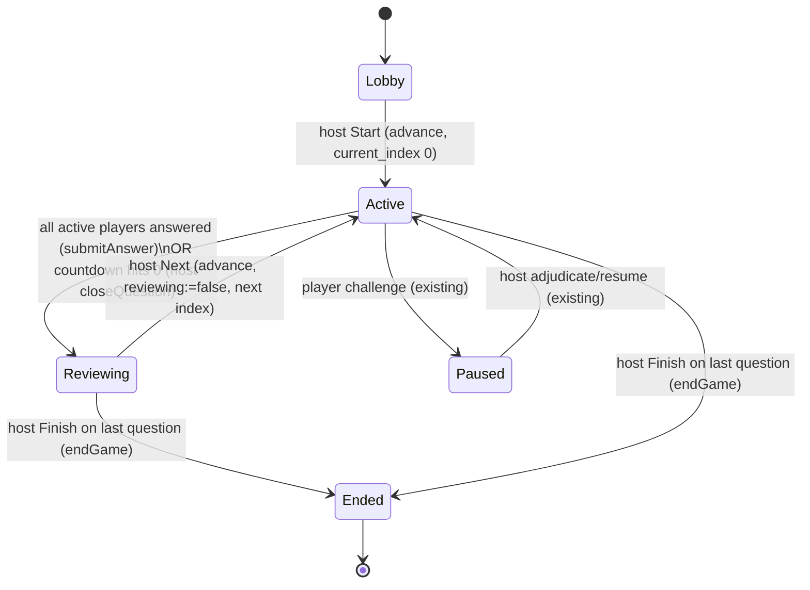

# Game UX Enhancements - Plan

## Goal Capsule

**Objective.** Raise the live game's polish and fairness with seven bounded
enhancements: celebratory animations (correct-answer fireworks, join bounce,
end-game podium), a punchier speed-scoring model (1000-point max, 100 floor), an
automatic per-question leaderboard review, easier-to-type numeric join codes, and
a cross-game question bank that prevents repeats.

**Product authority.** Host (gamemaster) runs the shared screen and paces the
game; players join on their own phones. Existing product shape is inherited
unchanged — this extends it, it does not reshape it.

**Open blockers.** None. All product rules resolved in the brainstorm (see
Product Contract). Planning resolved the technical approach (see Key Technical
Decisions).

**Product Contract preservation.** Unchanged. One clarification only: R1's "at
reveal" is realized as "on the correct submit result" because this app judges on
submit and has no separate answer-reveal step (see KTD5) — behavior-preserving,
not a scope change.

---

## Problem Frame

The game is functionally complete (setup → join → live speed-scored round with
challenge/adjudicate → results) but plain: no celebration, a modest 200-point
score ceiling, host-only manual pacing with the leaderboard always crammed under
the live question, six-character alphanumeric codes that are clumsy to read
aloud, and per-game question generation that can repeat prompts across games.

This plan adds polish and two behavior changes (scoring model, auto-review
pacing) plus two infrastructure changes (numeric codes with safeguards, a durable
dedup bank). Each enhancement is independent and shippable on its own.

**In scope:** the seven enhancements in the Product Contract (R1–R7).

**Out of scope:** see Scope Boundaries.

---

## Product Contract

Each enhancement is independent and shippable on its own. All seven hook into
mechanisms that already exist in the repo (noted per item).

### 1. Correct-answer fireworks

- **R1.1** When a player's own answer is judged **correct**, their device plays a
  small, brief fireworks/confetti burst at the moment correctness is known.
- **R1.2** The burst is lightweight and non-blocking — it never delays the
  transition to the next screen or obscures the answer reveal.
- **R1.3** No burst on incorrect, late, or missing answers.

### 2. Player-join bounce

- **R2.1** When a new player joins, the host lobby screen pops in a box showing
  that player's name and bounces it briefly (~1s), then settles into the roster.
- **R2.2** Driven by the existing `player_joined` realtime event.
- **R2.3** One animation per join; rapid successive joins queue or stack
  gracefully rather than overlapping into visual noise.

### 3. End-game podium

- **R3.1** At game end, the host screen reveals the **top 3** finishers on a
  podium, one at a time, **3rd → 2nd → 1st**, with a short pause between reveals.
- **R3.2** After the sequence, the full final standings remain viewable.
- **R3.3** Degrades gracefully with fewer than 3 scoring players and when nobody
  scored (no podium, existing "no winner" state).
- **R3.4** Ties for a rank **share the step**; the step below is skipped (two tied
  for 2nd → both on the 2nd step, no 3rd shown). No hidden tiebreak.

### 4. Speed scoring — 1000-point model

- **R4.1** A correct answer is worth up to **1000 points**, largest at reveal and
  decaying toward a **guaranteed floor of 100** at that question's deadline. Any
  correct in-window answer earns at least 100 — range 100–1000, never below 100.
- **R4.2** Decay is **normalized per answer mode**: it reaches the floor at *that
  mode's* own window (multiple-choice 20s, type-answer 35s), preserving the
  fairness rule that type-answer is not penalized for being inherently slower.
- **R4.3** Wrong, late (past the window), or missing answers score 0. The floor
  applies only to answers that are both correct and within the window.
- **R4.4** Replaces the current 200-point model (100 base + 100 exponential
  bonus). Display countdown and server scoring stay in agreement.

### 5. Automatic leaderboard review

- **R5.1** When **all active (non-spectator) players have answered** the current
  question, **or** the answer timer expires, the game moves to a
  **leaderboard-review** state showing current standings.
- **R5.2** From the review, the **host clicks Next** to reveal the following
  question. Pacing stays host-controlled.
- **R5.3** The review respects the existing **challenge/pause** guard: an open
  challenge blocks advancing until the host adjudicates, and a re-score updates
  the standings shown.
- **R5.4** "All answered" is evaluated **server-side** against the active-player
  count for the current question.

### 6. Numeric join codes + safeguards

- **R6.1** Join codes are **numeric only, exactly 5 digits**.
- **R6.2** Because a 5-digit numeric space is only 100,000 combinations, ship
  these safeguards together with the change:
  - **R6.2a** Only games in `lobby` or `active` status are joinable by code.
  - **R6.2b** A code is **retired the moment its game ends** (no longer admits
    joins; the numeric value is freed for reuse by a new game).
  - **R6.2c** A **tighter per-IP join rate-limit** so a scan of the 100k space is
    impractical.
- **R6.3** Codes are still generated with cryptographic randomness (never
  sequential).

### 7. Global question dedup bank

- **R7.1** Every generated question is recorded in a **durable, cross-game** store
  that is **not** deleted when a game ends.
- **R7.2** Before generating a new set, generation **checks the bank** and
  excludes questions whose prompt matches an existing one by **normalized text**
  (case-insensitive, whitespace/punctuation-normalized exact match). No embedding
  step.
- **R7.3** If dedup filtering leaves a set short, the existing tail-regeneration
  loop requests replacements until the count is met or attempts are exhausted.

---

## Scope Boundaries

**Deferred for later**
- Semantic/embedding-based dedup for reworded duplicates.
- Per-host bank scoping (v1 is one global bank; storage must not preclude adding a
  host scope column).
- Fireworks/celebration on the host shared screen (v1 is player-device only).
- Configurable animation intensity / reduced-motion preference.

**Deferred to Follow-Up Work**
- Replacing the best-effort per-instance rate limiter with a shared store
  (Supabase/Redis) — the tightened constant (R6.2c) is the v1 mitigation; the
  documented per-instance ceiling is unchanged.
- Serving a reused question straight from the bank without an xAI call (the bank
  stores full questions per KTD4, so this becomes possible but is not built here).

**Outside this change's identity**
- No change to accounts/auth (play stays anonymous and ephemeral).
- No change to the challenge/adjudicate mechanism itself — enhancements coexist
  with it, they do not modify it.
- No change to categories, difficulty, or answer-mode configuration.

---

## Key Technical Decisions

- **KTD1 — Speed score becomes floor-plus-normalized-bonus, continuous.** Rewrite
  `computeScore` in `lib/scoring/speed.ts` as `floor + round(bonus * (1 -
  fraction))` where `floor = 100`, `bonus = 900`, and `fraction = clamp(elapsed,
  0, timer) / timer` against that mode's `ANSWER_TIMER_MS`. Correct in-window →
  100–1000; wrong/late → 0. This honors "normalize per mode" and the 100 floor
  from the brainstorm; the literal "−50/sec" is realized as the resolved
  1000→100 curve (~−45/sec effective for the 20s window), continuous like the
  existing ms-based decay rather than whole-second steps. Drops `BASE_POINTS`,
  `MAX_TIME_BONUS`, and the per-mode `DECAY_EXPONENT` — normalization already
  gives type-answer a gentler absolute slope.
- **KTD2 — Retire codes by recycling the numeric namespace, not nulling them.**
  Replace the global `games.code` unique constraint with a **partial unique index
  on `code` where `status in ('lobby','active')`**, and filter the join-by-code
  lookup to live games. An ended game keeps its `code` value for its results UI
  but is no longer unique or reachable by code — so a new game may reuse that
  5-digit value, and the 100k space never exhausts. R6.2a is *already* enforced by
  `seatForStatus` (ended → `canJoin:false`); this decision is what actually
  implements R6.2b without a nullable-code type change. Token-based hydrate is
  unaffected (it resolves by player token, never by code).
- **KTD3 — Review phase is a `games.reviewing` flag, host-timer-closed.** Add a
  boolean `reviewing` to `games`, exposed by the `hydrate_game_state` RPC so every
  client renders the review screen off hydrated state (matching the
  hydrate-then-delta model — clients don't read event payloads for state). Two
  triggers set it: `submitAnswer` flips it when the answered-count reaches the
  active-player count (R5.4, server-side); the **host client** calls a new
  `closeQuestion` action when its countdown hits zero (R5.1 timer path) — no
  serverless background timer exists, and the host is already the pacing
  authority. `advance` clears `reviewing` on the next reveal. A new `review`
  broadcast event drives reconciliation. The existing `paused`/advance guard
  (KTD refuses advance while a challenge is open) is untouched, satisfying R5.3.
- **KTD4 — Dedup via a normalized-prompt unique index + regeneration on
  collision.** A durable `question_bank` table (no `game_id` FK, never cascaded)
  stores the full validated question plus a `prompt_norm` column with a unique
  index. `normalizePrompt` (new pure helper `lib/generation/dedup.ts`:
  lowercase, collapse whitespace, strip punctuation) is the match key.
  `generateQuestions` takes an injectable "already seen" set so a duplicate is
  rejected exactly like an invalid question, driving the existing bounded
  tail-regeneration (R7.3, fails loud if it can't fill). `generateAndPersist`
  loads existing norms, passes them in, then writes survivors to both the
  per-game `questions` table and the bank (conflict-ignore). Storing full
  questions (not just hashes) keeps R7.1 durable and enables future bank reuse
  (deferred).
- **KTD5 — Fireworks live in `AnswerPanel`, the single correctness source.** The
  app judges on submit and returns `{correct, points}` immediately — there is no
  separate reveal moment. Rendering the burst inside `AnswerPanel` (which owns the
  submit result) means both the player view and the host-plays view get it for
  free, with no new plumbing. Realizes R1 against the app's actual feedback point.
- **KTD6 — Join-bounce consumes the `player_joined` event payload directly.** The
  event already carries `{id, username, isSpectator}`, but `useRoomState` ignores
  the payload and only re-hydrates. The host lobby adds a targeted subscription (or
  a small `useJoinAnnouncements` hook) that reads the username for a transient
  bounce, rather than diffing the roster across hydrations. Lobby-only (R2.1).

---

## High-Level Technical Design

Question lifecycle with the new **reviewing** state (R5). `reveal_at` and
`reviewing` are the two server-authoritative fields the countdown and screen
routing read from hydrated state.



Scoring curve (R4), per mode, correct in-window answers only:

```
points = 100 + round(900 * (1 - clamp(elapsed,0,timer)/timer))
  elapsed = submitAt - revealAt (server ms)
  timer   = ANSWER_TIMER_MS[mode]   (MC 20_000, type 35_000)
  reveal  -> 1000    deadline -> 100    wrong/late -> 0
```

---

## Implementation Units

Ordered by dependency. U1, U2/U3, U4, U8, U9, U10 are mutually independent; the
review trio U5→U6→U7 is sequential.

### U1. Speed scoring — 1000-point / 100-floor model

**Goal:** Replace the 200-point exponential model with the floor-plus-normalized
curve (KTD1).

**Requirements:** R4.1, R4.2, R4.3, R4.4

**Dependencies:** none

**Files:**
- `lib/scoring/speed.ts`
- `lib/scoring/__tests__/speed.test.ts`

**Approach:**
- New constants `FLOOR_POINTS = 100`, `MAX_POINTS = 1000` (bonus range = 900).
  Remove `BASE_POINTS`, `MAX_TIME_BONUS`, `DECAY_EXPONENT`.
- `computeScore`: wrong → 0; `elapsed > timer` → 0; else `FLOOR_POINTS +
  round((MAX_POINTS - FLOOR_POINTS) * (1 - clamp(elapsed,0,timer)/timer))`.
- `submitAnswer` and `useQuestionCountdown` already read `ANSWER_TIMER_MS`; no
  change needed there — the same per-mode window drives both.

**Patterns to follow:** the existing `computeScore` signature and clamp/late
guards in the same file (keep them; only the formula and constants change).

**Test scenarios:**
- Answer at reveal (elapsed 0) → 1000, both modes.
- Answer at deadline (elapsed = timer) → exactly 100, both modes.
- Answer just past deadline (elapsed = timer + 1) → 0.
- Wrong answer at any time → 0.
- Clock skew (elapsed < 0) clamps to 1000, not above.
- Equal fraction across modes (e.g. 50% of each window) → equal points.
- Mid-window multiple-choice (elapsed 10s of 20s) → 550 (100 + 450).

### U2. Numeric 5-digit join codes

**Goal:** Generate and validate numeric-only 5-digit codes (R6.1, R6.3).

**Requirements:** R6.1, R6.3

**Dependencies:** none

**Files:**
- `lib/codes.ts`
- `lib/__tests__/codes.test.ts`
- `lib/join.ts`
- `lib/__tests__/join.test.ts`

**Approach:**
- In `lib/codes.ts`: `CODE_ALPHABET = "0123456789"`, `ROOM_CODE_LENGTH = 5`. Keep
  the rejection-sampling loop and `randomBytes` (R6.3) — only alphabet/length
  change. Update the module comment (the "no I/L/O/0/1" rationale no longer
  applies; note the deliberately smaller space + safeguards in U3).
- In `lib/join.ts`: `isValidCodeShape` regex → `^[0-9]{5}$`. `normalizeCode` keeps
  `.trim()`; `.toUpperCase()` is a harmless no-op on digits — optionally strip to
  digits only.

**Patterns to follow:** existing `generateRoomCode` structure; existing
`isValidCodeShape` test cases (update expected shape).

**Test scenarios:**
- Generated code matches `^\d{5}$`; length is exactly 5.
- Many samples stay within the digit alphabet (no letters).
- `isValidCodeShape` accepts `"01234"`, rejects `"ABCDE"`, `"1234"` (4),
  `"123456"` (6), `"12 34"`.
- `normalizeCode(" 01234 ")` → `"01234"`.

### U3. Retire codes on end + recycle namespace + tighter rate-limit

**Goal:** Free an ended game's code for reuse, keep ended games unreachable by
code, and tighten join throttling (R6.2).

**Requirements:** R6.2a, R6.2b, R6.2c

**Dependencies:** U2 (numeric codes are the namespace being recycled)

**Files:**
- `supabase/migrations/0004_code_retire.sql`
- `app/actions/joinGame.ts`

**Approach:**
- Migration: `alter table public.games drop constraint games_code_key;` then
  `create unique index games_code_live_unique on public.games(code) where status
  in ('lobby','active');`. This lets a new lobby/active game reuse an ended
  game's code while still preventing two live games from colliding.
- `joinGame`: add `.in("status", ["lobby","active"])` to the code lookup so it
  only ever resolves the live game for a reused code (prevents `maybeSingle`
  ambiguity). `seatForStatus` already rejects `ended` (R6.2a) — unchanged.
- `joinGame`: tighten `joinLimiter` from `(10, 60_000)` to a stricter value
  (e.g. `(5, 60_000)`) (R6.2c). Note in the comment that this is best-effort
  per-instance (shared store deferred).
- `createGame`'s 5-attempt collision retry is unchanged — the partial unique
  still raises `23505` on a live-code collision, which the retry already handles.

**Patterns to follow:** existing migration style in `supabase/migrations/`;
existing `joinLimiter` construction and the `.eq("code", code).maybeSingle()`
lookup.

**Test scenarios:**
- `Covers R6.2c.` `joinGame` unit/e2e: the tightened limit rejects the
  (limit+1)-th attempt from one IP within the window.
- `Covers R6.2b.` e2e: a game ends; a new game created afterward can be issued the
  same 5-digit code and is joinable, while the ended game's code no longer admits
  a join.
- Migration applies cleanly and the partial index rejects a second live game with
  a duplicate code.
- Test expectation for the migration itself: none — schema DDL, verified via the
  e2e reuse scenario above.

### U4. Global question dedup bank

**Goal:** A durable cross-game bank that generation checks and appends to, so
prompts never repeat (R7).

**Requirements:** R7.1, R7.2, R7.3

**Dependencies:** none

**Files:**
- `supabase/migrations/0005_question_bank.sql`
- `lib/generation/dedup.ts`
- `lib/generation/__tests__/dedup.test.ts`
- `lib/generation/xai.ts`
- `lib/generation/__tests__/xai.test.ts`
- `app/actions/generate.ts`

**Approach:**
- Migration: `question_bank` table — `id uuid pk`, full question columns
  (`prompt`, `mode`, `options`, `correct_option`, `accepted_variants`,
  `difficulty`, `categories text[]`), `prompt_norm text not null`, `created_at`.
  `create unique index on question_bank(prompt_norm)`. Default-deny RLS, enable
  RLS with no anon policies (service-role only, matching 0001 posture). No
  `game_id` FK — never cascaded (R7.1).
- `lib/generation/dedup.ts`: pure `normalizePrompt(s)` — lowercase, strip
  punctuation, collapse whitespace, trim.
- `lib/generation/xai.ts`: `generateQuestions` accepts an optional `seen:
  Set<string>` of normalized prompts (default empty). In the collect loop, compute
  `normalizePrompt(q.prompt)`; if already in `seen` (or seen this run), reject with
  a `"duplicate"` reason (feeds `rejections`, triggers tail regeneration, R7.3).
  Add each accepted prompt's norm to the run set so a single batch can't
  self-duplicate.
- `app/actions/generate.ts`: before generating, `select prompt_norm from
  question_bank` (optionally scoped by category to bound the set) into a Set; pass
  it as `seen`. After validation, insert survivors into `questions` (unchanged)
  **and** upsert into `question_bank` with `onConflict: prompt_norm, ignore`.

**Patterns to follow:** `validateGeneratedQuestion`'s `{ok:false, reason}` shape
for the new duplicate rejection; existing `.insert(rows)` persistence in
`generateAndPersistQuestions`; RLS/default-deny posture in
`supabase/migrations/0001_init.sql`.

**Test scenarios:**
- `normalizePrompt`: "What is the capital of France?" and "what is the CAPITAL of
  france" normalize equal; punctuation/whitespace variants collapse; distinct
  prompts stay distinct.
- `generateQuestions` with a `seen` set containing a returned prompt's norm rejects
  it and regenerates to still return `count` unique questions.
- Two identical prompts within one batch → only one kept, the other regenerated.
- Exhausted attempts with unavoidable duplicates → throws `GenerationError`
  reporting the `duplicate` rejection (fails loud, R7.3).
- `generateAndPersist` (integration): existing bank prompt is excluded from a new
  set; survivors land in both `questions` and `question_bank`; re-inserting a
  duplicate norm is a no-op (conflict ignored).

### U5. Review phase — schema, state exposure, event

**Goal:** Add the `reviewing` game state and surface it to clients (KTD3
foundation).

**Requirements:** R5.1, R5.4 (infrastructure)

**Dependencies:** none (foundation for U6, U7)

**Files:**
- `supabase/migrations/0006_review_phase.sql`
- `lib/db/types.ts`
- `lib/realtime/events.ts`

**Approach:**
- Migration: `alter table public.games add column reviewing boolean not null
  default false;` and `create or replace function public.hydrate_game_state` (copy
  the current body from `0002_rpcs.sql`) adding `'reviewing', g.reviewing` to the
  `game` jsonb object.
- `lib/db/types.ts`: add `reviewing: boolean` to `GameRow` and `ClientGame`.
- `lib/realtime/events.ts`: add `review: "review"` to `ROOM_EVENTS` with a doc
  line ("Question closed for answers — clients show the review leaderboard").

**Patterns to follow:** the existing `hydrate_game_state` jsonb-build and the
`ROOM_EVENTS` map with its per-event comments.

**Test scenarios:**
- `lib/db/__tests__/schema.test.ts` (existing schema/type guard): `reviewing`
  present on the game shapes.
- Test expectation for the migration/RPC: none — DDL, verified through U6/U7 flow
  and e2e.

### U6. Review phase — server triggers

**Goal:** Enter review when all active players answer or the host closes the
question; leave it on advance (KTD3).

**Requirements:** R5.1, R5.2, R5.3, R5.4

**Dependencies:** U5

**Files:**
- `app/actions/submitAnswer.ts`
- `app/actions/closeQuestion.ts` (new)
- `app/actions/advance.ts`
- `lib/realtime/hooks.ts`

**Approach:**
- `submitAnswer`: after the answer row is inserted, count non-spectator players in
  the game and answers for the current `question_id`. When answered ≥ active, set
  `games.reviewing = true` (CAS on `reviewing = false` to broadcast once) and
  broadcast `ROOM_EVENTS.review`. Still broadcast `leaderboard` as today.
- New `closeQuestion(code, hostToken, expectedIndex)`: host-token-gated (reuse
  `authorizeHostByCode`); if the game is `active`, not `paused`, and at
  `expectedIndex`, set `reviewing = true` (idempotent CAS) and broadcast `review`.
  Mirrors `advance`'s authorize + compare-and-set shape.
- `advance`: add `reviewing: false` to the update that reveals the next question
  (it already sets `paused:false, status:'active'`).
- `lib/realtime/hooks.ts`: add `[ROOM_EVENTS.review]: reconcile` to the
  subscription map (clients re-hydrate and read `reviewing`).

**Patterns to follow:** `advance.ts` authorize + CAS + broadcast; the existing
dup-guard/serialized-write reasoning in `submitAnswer`.

**Test scenarios:**
- `Covers R5.4.` submitAnswer integration: last active player's submit flips
  `reviewing` true and broadcasts `review`; an earlier submit does not.
- `Covers R5.1.` closeQuestion sets `reviewing` when active and at the expected
  index; is a no-op when already reviewing, when paused, or on a stale index.
- `Covers R5.3.` closeQuestion / advance refuse or defer correctly while
  `paused` (advance already throws on open challenge — unchanged).
- `Covers R5.2.` advance from a reviewing state reveals the next question with
  `reviewing:false`.
- Test expectation: server actions have no unit harness (repo convention) — cover
  via e2e in U7; extract the answered-vs-active comparison to a `lib/` helper if a
  pure unit test is wanted.

### U7. Review phase — host + player UI

**Goal:** Render the review leaderboard when `reviewing`, close the question at
timer-zero from the host, and keep answering locked during review (KTD3).

**Requirements:** R5.1, R5.2

**Dependencies:** U5, U6

**Files:**
- `app/(host)/host/page.tsx`
- `app/(play)/play/page.tsx`

**Approach:**
- Host: when `game.reviewing`, emphasize the leaderboard section and keep the
  existing "Next question" / "Finish game" controls (they call `advance` /
  `endGame` unchanged); hide the live `AnswerPanel`/countdown. Add an effect: when
  `remaining !== null && remaining <= 0` and started, not ended, not paused, not
  already reviewing, call `closeQuestion(code, token, game.current_index)` once.
- Player: when `game.reviewing`, show a "Answers locked — standings" review view
  (leaderboard emphasized, `AnswerPanel` and challenge buttons hidden); otherwise
  unchanged. The between-question leaderboard already exists — this promotes it to
  a distinct review screen keyed on `reviewing`.

**Patterns to follow:** existing `paused`/`voided`/`spectating` conditional
overlays in `play/page.tsx`; the host live-section conditional structure and its
`handleAdvance`/`handleFinish` handlers.

**Test scenarios:**
- `Covers R5.1.` e2e: all players answer → both host and players show the review
  leaderboard; the live answer UI is gone.
- `Covers R5.1.` e2e: nobody answers and the timer expires → host auto-closes the
  question into review.
- `Covers R5.2.` e2e: host clicks Next from review → next question reveals and
  answering re-enables.
- `Covers R5.3.` e2e: a challenge open at review time blocks Next until the host
  adjudicates.
- Test expectation: Playwright multi-client specs (live env; `e2e/README.md`).

### U8. Correct-answer fireworks

**Goal:** Brief celebratory burst on the device when the player's submit is
correct (KTD5).

**Requirements:** R1.1, R1.2, R1.3

**Dependencies:** none (independent; touches shared `AnswerPanel`)

**Files:**
- `components/AnswerPanel.tsx`
- `components/Fireworks.tsx` (new)
- `app/globals.css`

**Approach:**
- `components/Fireworks.tsx`: a self-contained, purely presentational burst
  (CSS-animated particles or a small canvas), absolutely positioned, non-blocking,
  auto-removing after its animation (~1s), `aria-hidden`.
- `AnswerPanel`: when its own submit result is `correct`, mount `<Fireworks/>`
  once for that question. Because both the player view and the host-plays view
  render `AnswerPanel`, both get the burst with no extra wiring (KTD5).
- No burst on incorrect/late/spectator results (R1.3).

**Patterns to follow:** existing `AnswerPanel` result handling and `onResult`
flow; `app/globals.css` animation/keyframe conventions.

**Test scenarios:**
- Burst renders when the submit result is correct; does not render for an
  incorrect result, a spectator non-scoring result, or before submit.
- The burst element is `aria-hidden` and does not block the answer/challenge
  controls.
- Test expectation: light — this is presentational. A component render test for
  the correct-vs-incorrect gate; visual behavior verified manually / in e2e.

### U9. Player-join bounce on the host lobby

**Goal:** Announce each join with a bouncing name box on the host lobby (KTD6).

**Requirements:** R2.1, R2.2, R2.3

**Dependencies:** none

**Files:**
- `app/(host)/host/page.tsx`
- `components/JoinToast.tsx` (new)
- `app/globals.css`

**Approach:**
- Add a targeted `player_joined` subscription in the host lobby (or a small
  `useJoinAnnouncements(code)` hook) that reads the event's `{username}` payload
  (KTD6) and pushes it onto a short-lived queue.
- `components/JoinToast.tsx`: renders the queued name box with a ~1s bounce, then
  removes it; multiple rapid joins stack/queue rather than overlap (R2.3).
- Show only while in the lobby (`!started`) per R2.1.

**Patterns to follow:** `subscribeToRoom` usage in `lib/realtime/hooks.ts` and
`lib/realtime/channel.ts`; the lobby "Players" section in `host/page.tsx`;
`app/globals.css` animation conventions.

**Test scenarios:**
- A join event renders a bounce box with the joiner's name in the lobby.
- Two joins in quick succession both appear (queued/stacked), neither lost.
- No bounce fires once the game has started (lobby-only).
- Test expectation: light/presentational — a component test for queue rendering;
  the live trigger is covered incidentally by the existing join e2e.

### U10. End-game podium (host)

**Goal:** Sequenced 3rd→2nd→1st podium reveal with shared-step ties (R3).

**Requirements:** R3.1, R3.2, R3.3, R3.4

**Dependencies:** none

**Files:**
- `lib/results.ts`
- `lib/__tests__/results.test.ts`
- `app/(host)/host/page.tsx`
- `components/Podium.tsx` (new)
- `app/globals.css`

**Approach:**
- `lib/results.ts`: add `podium(standings)` returning up to three **rank groups**
  by distinct score (rank 1/2/3), each group holding the tied players for that
  rank (R3.4), excluding zero scores (reuse the `winners` "top ≤ 0 → none"
  rule). Pure and unit-tested.
- `components/Podium.tsx`: renders the three steps and reveals them 3rd → 2nd →
  1st on a short timer (R3.1); tied players share a step; missing ranks (fewer
  than 3 scoring groups) render empty/omitted (R3.3).
- `host/page.tsx`: in the `ended` branch, render `<Podium/>` above the existing
  full standings list (which stays for R3.2). The "no winner" case (empty podium)
  keeps the existing message.

**Patterns to follow:** existing `sortStandings` / `winners` / `describeWinners`
in `lib/results.ts` and their tests; the current `ended` results block in
`host/page.tsx`.

**Test scenarios:**
- Three distinct scores → three single-player steps in 1/2/3 order.
- Two tied for 2nd → they share the 2nd step and no 3rd step is shown (R3.4).
- Two tied for 1st → shared top step, then 3rd-ranked next (per distinct score).
- Fewer than 3 scoring players → only populated steps returned (R3.3).
- Nobody scored (all 0) → empty podium (R3.3).
- More than 3 players → only the top 3 distinct score-ranks appear.

---

## Verification Contract

- `npm run typecheck` and `npm run lint` pass.
- `npm test` passes, including new/updated unit suites: `speed.test.ts` (U1),
  `codes.test.ts` / `join.test.ts` (U2), `dedup.test.ts` / `xai.test.ts` (U4),
  `results.test.ts` (U10).
- Migrations `0004`–`0006` apply cleanly to the Supabase project.
- `npm run test:e2e` passes, including new coverage for the review flow (U7), code
  reuse + rate-limit (U3), and the existing multi-client flow (live env required).
- Manual smoke: correct answer shows a burst; a join bounces on the host lobby;
  all-answered (and timer-expiry) moves to the review leaderboard and Next
  advances; end shows a 3rd→2nd→1st podium; codes are 5-digit numeric.

## Definition of Done

- All units U1–U10 implemented; R1–R7 satisfied.
- Verification Contract gates pass.
- Scoring, review-phase, and code-namespace behavior changes are covered by tests,
  not just manual checks.
- Stale comments updated (the codes "unambiguous alphabet" rationale in
  `lib/codes.ts`; any host-view/leaderboard comments touched by the review phase).
- No orphaned-game or double-broadcast regressions introduced by the review CAS.

---

## Sources & Research

- Origin: this file's Product Contract (brainstorm, `product_contract_source:
  ce-brainstorm`) — the resolved WHAT for R1–R7.
- `lib/scoring/speed.ts`, `lib/gameConfig.ts` — the 200-point model and per-mode
  `ANSWER_TIMER_MS` that U1 rewrites and normalizes against.
- `lib/codes.ts`, `lib/join.ts`, `app/actions/joinGame.ts`, `lib/rateLimit.ts` —
  code generation, shape validation, join lookup, and the best-effort limiter
  (U2/U3).
- `app/actions/submitAnswer.ts`, `app/actions/advance.ts`,
  `supabase/migrations/0002_rpcs.sql` (`hydrate_game_state`),
  `lib/realtime/{events,hooks}.ts` — the live loop, hydrate-then-delta model, and
  broadcast vocabulary the review phase extends (U5–U7).
- `lib/generation/{xai,schema}.ts`, `app/actions/generate.ts` — generation,
  validation, tail-regeneration, and persistence the dedup bank hooks into (U4).
- `app/(host)/host/page.tsx`, `app/(play)/play/page.tsx`,
  `components/AnswerPanel.tsx`, `lib/results.ts` — the views and ranking helpers
  the animations and podium extend (U7–U10).
- `docs/solutions/architecture-patterns/anonymous-realtime-multiplayer-on-supabase-serverless.md`,
  `AGENTS.md` — token-auth/RLS posture, server/client split, thin-server-action
  and unit-tested-`lib/` conventions.
