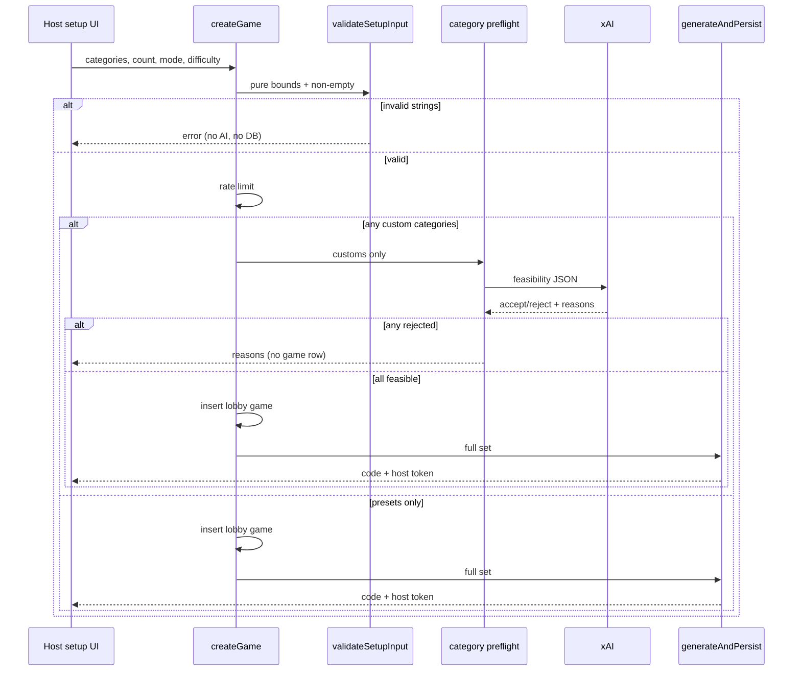

# feat: Glorious host greeting, expanded/custom categories, always-on challenges

## Goal Capsule

- **Objective:** Make hosting feel celebratory, give gamemasters a much larger category palette with type-in custom topics that AI can reject as infeasible, and ensure players can always challenge answers when the model is wrong.
- **Authority:** This plan is the product + implementation source of truth for this work (`product_contract_source: ce-plan-bootstrap`). Prefer live code patterns in `lib/gameConfig.ts`, `app/actions/createGame.ts`, `lib/generation/xai.ts`, and `app/actions/challenge.ts` over older plan text when they conflict on implementation detail. Product R13 (challenge cap) is intentionally superseded here.
- **Stop conditions:** Stop if preflight cannot reuse the existing xAI client pattern without a second paid provider, or if removing the challenge cap requires a new host-mute subsystem (deferred — out of scope).
- **Execution profile:** Standard feature work across setup UX, generation preflight, and challenge policy. No schema migration.
- **Tail ownership:** Implementer owns unit tests and setup/createGame wiring; e2e stays green with the existing `Geography` preset.

---

## Product Contract

### Summary

Greet the gamemaster gloriously on setup, expand preset categories and allow typed custom categories with an AI feasibility preflight that can reject some topics before any game is created, and remove the per-player challenge cap so players can always dispute AI answers. Host adjudication and one-open-challenge-per-question remain.

### Problem Frame

Setup is functional but plain (`Host a game` with ten fixed checkboxes). Custom party topics are impossible because validation only allows the seed list. The challenge mechanism already exists as the fairness answer to AI error, but a per-player cap of three can still leave a wrong answer unchallengeable after a few disputes.

### Actors

- A1. **Gamemaster (host)** — configures the game, receives the glorious greeting, picks/types categories, creates the room, adjudicates challenges.
- A2. **Player** — joins, answers, raises challenges without a game-wide cap.
- A3. **AI question generator (xAI)** — feasibility preflight for custom categories at setup; full question generation after create; not used during live play.

### Requirements

- R1. On the host setup page, the gamemaster is greeted gloriously: celebratory title treatment plus a rotating one-line tagline under the heading (design reference: `buzzr-trivia-redesign.dc.html` TAGLINES, ~2.2s rotation).
- R2. The preset category list is greatly expanded beyond the current ten seeds while remaining a static allowlist of presets.
- R3. The gamemaster can add custom categories by typing them in (add-to-selection), and can remove them before submit.
- R4. Setup validation accepts any non-empty selection of presets and/or customs within length and count bounds; empty, overlong, or over-count selections are rejected client- and server-side.
- R5. Before a game row is created, the system runs an AI feasibility preflight on **custom** categories only. Presets are always treated as feasible and skip the model call when the selection is presets-only.
- R6. Infeasible custom categories are rejected with a clear human-readable reason per rejected topic. No game is created. The host can edit the selection (remove/adjust customs) and retry from the setup form.
- R7. Feasible customs proceed into the existing whole-set generation path unchanged (categories remain `text[]` on the game).
- R8. Any player may raise a challenge on the active question (question wrong or own answer wrongly marked) without a per-game challenge cap. Host adjudication, pause/resume, void/rescore, and at-most-one open challenge per player per question remain.
- R9. Challenge affordances stay available during answering and review (not while paused, voided, or spectating), matching current review-phase behavior.

### Key Flows

- F1. **Glorious setup**
  - **Trigger:** Host opens `/setup`.
  - **Steps:** Sees celebratory greeting + rotating tagline; configures host-play, categories (preset and/or custom), count, mode, difficulty; submits.
  - **Outcome:** Create path runs (with preflight when needed) or stays on form/error.
- F2. **Custom category rejection**
  - **Trigger:** Host submits a selection containing one or more custom categories.
  - **Steps:** String validation; AI preflight on customs; if any fail, return reasons without inserting a game; host edits and retries.
  - **Outcome:** No orphan lobby; rejected topics named with reasons.
- F3. **Unlimited challenges**
  - **Trigger:** Player disputes a question or marking during live answer or review.
  - **Steps:** Token-validated challenge inserts; game pauses; host adjudicates; scores recompute as today; player may challenge again later without a game-wide cap.
  - **Outcome:** AI errors remain fixable for the whole game.

### Acceptance Examples

- AE1. **Covers R1.** Given a host on `/setup`, when the page is open for several seconds, then a greeting and rotating tagline are visible under the host title without blocking the form.
- AE2. **Covers R2, R3, R4.** Given an expanded preset list, when the host checks multiple presets and adds a typed custom "90s Sitcoms", then submit is enabled with at least one category selected.
- AE3. **Covers R5, R6.** Given a custom category the model judges infeasible (e.g. "My private family nicknames from last Tuesday"), when the host submits, then creation fails with a reason, no room code is issued, and Back-to-edit preserves form state.
- AE4. **Covers R5, R7.** Given only presets, when the host submits, then no feasibility model call runs and generation proceeds as today.
- AE5. **Covers R8.** Given a player who has already raised three challenges this game, when they raise another on a new question, then the challenge is accepted and the game pauses (supersedes legacy AE5/cap).
- AE6. **Covers R8, R9.** Given review after a wrong answer, when the player challenges the question or marking, then the challenge works as in the review-phase behavior (no cap block).

### Success Criteria

- Host setup feels intentional and fun on first open (greeting + taglines).
- At least ~3× the current preset count is available as selectable presets.
- Custom categories work end-to-end when feasible; infeasible ones fail fast with reasons and no orphan games.
- Players are never blocked by a per-game challenge count limit.
- Existing unit tests and e2e helpers remain valid for the `Geography` preset.

### Scope Boundaries

**In scope**

- Setup-page greeting and rotating taglines (setup surface only).
- Expanded static preset list + type-in custom categories.
- Pure validation bounds + AI preflight for customs before game insert.
- Remove per-player challenge cap enforcement and related tests/docs wording.

**Out of scope**

- Full Buzzr visual redesign of all screens (Fredoka/tokens/pills app-wide).
- Home-page hero overhaul beyond any optional link copy (greeting is setup-focused).
- Pre-game human vet of generated questions.
- Host mute / ban of serial flaggers.
- Global/shared custom category catalogs or admin taxonomy UI.
- Content-safety moderation beyond feasibility (deferred product work).
- Schema migrations (categories already `text[]`).

### Deferred to Follow-Up Work

- Host tools for serial challenge griefing if unlimited challenges prove noisy in large groups.
- Optional client-side preflight action that validates customs before the full Create click (same server logic, earlier UX).
- Rich category search/filter UI if the expanded list becomes hard to scan.

---

## Planning Contract

### Assumptions

- "Glorious" means setup-page celebratory copy + rotating taglines from the design prototype, not a new animation system or home-route redesign.
- Expanded presets target roughly 30–40 well-known trivia domains (implementer may tune exact names); keep `Geography` for e2e.
- Feasibility means: the model can produce a full set of fair, objective, judgeable trivia questions in the chosen answer mode (not pure opinion, not private knowledge, not unjudgeable subjective taste).
- Preflight rejects **per custom category** with reasons; if any custom is rejected, the whole create aborts (host removes/adjusts) rather than silently dropping categories.
- Challenge griefing remains bounded by one open challenge per player per question + host must adjudicate before advance; full cap removal is intentional per product confirmation.

### Key Technical Decisions

- KTD1. **Preflight before game insert.** Run AI feasibility only when the selection includes non-preset strings, and only **before** `games` insert in `createGame`. Presets-only selections skip the model. This avoids rollback orphans on rejection and reuses the setup error / Retry / Back-to-edit machine.
- KTD2. **Pure validation for strings; AI only for feasibility.** `validateSetupInput` accepts presets ∪ free-text within `MAX_CATEGORIES`, per-string length, and non-empty trim rules. Feasibility is a separate `lib/generation` helper with structured accept/reject results, unit-tested with mocked fetch like `generateQuestions`.
- KTD3. **Short, bounded preflight call; fail closed.** One lightweight xAI JSON request with a hard timeout shorter than full generation (directional: ~8–10s), rate-limited by the existing createGame IP limiter, **not** counted against `activeGenerations` concurrent full-gen slots. Missing API key, timeout, malformed JSON, or a response that omits any requested custom category fails the create with a retryable error (do not silently treat missing entries as feasible).
- KTD4. **Remove challenge cap, keep structural anti-spam.** Delete `CHALLENGE_CAP` enforcement from `challenge` action and pure helpers (or leave helper dead-code-free by removing it). Keep unique open-challenge-per-player-per-question index and host adjudication CAS.
- KTD5. **No DB migration.** `games.categories text[]` already stores arbitrary labels; preflight and generation only change validation and prompt content.
- KTD6. **Greeting is client-only.** Tagline constants + `useEffect` interval (~2200ms) on the setup page; no server/AI involvement.

### High-Level Technical Design

**Create-game path with preflight**

**Category acceptance decision**

| Input kind | String bounds | AI preflight | On fail |
|---|---|---|---|
| Preset (exact match to expanded `CATEGORIES`) | yes | skip | n/a |
| Custom (not in presets after normalize) | yes | required | abort create with reasons |
| Empty / overlong / over-count | reject in pure validation | skip | abort create |

### Implementation Constraints

- Keep pure logic in `lib/` with Vitest coverage; keep server actions thin.
- Service-role `createGame` / `challenge` still authorize by token / rate limit; do not trust client category "isPreset" flags — re-derive preset membership server-side from the shared list.
- Do not call xAI during live play or adjudication.
- Do not rename or remove the `Geography` preset without updating `e2e/helpers.ts`.
- Prefer shared chat-completions helper extraction only if it reduces duplication without a large refactor; preflight may call xAI with a focused prompt paralleling `lib/generation/xai.ts`.

### Sequencing

1. U1 validation + expanded presets (unblocks UI and preflight).
2. U2 setup greeting + custom category UI (depends on U1 helpers).
3. U3 preflight wired into createGame (depends on U1).
4. U4 challenge cap removal (independent; can parallel with U1–U3).

Suggested landing order: U1 → U2 → U3 → U4 (or U4 anytime after tests exist).

### Product Contract preservation

Product Contract defined in this plan (`ce-plan-bootstrap`). Supersedes foundation-plan R13/AE5 challenge-cap product wording for this workstream; other fairness rules (R10–R12, pause, host arbiter) preserved.

---

## Implementation Units

### U1. Expand presets and allow custom categories in validation

**Goal:** Greatly expand the static preset list and change `validateSetupInput` so custom free-text categories are accepted within safe bounds.

**Requirements:** R2, R4

**Dependencies:** none

**Files:**

- `lib/gameConfig.ts` (modify)
- `lib/__tests__/gameConfig.test.ts` (modify)

**Approach:**

- Grow `CATEGORIES` to a substantially larger static seed set (roughly 30–40 domains spanning classic trivia plus popular culture niches). Keep exact string `Geography`.
- Export helpers such as `isPresetCategory(name)` (case-insensitive match against the preset list) and bounds constants. Directional defaults: `CATEGORY_MAX_LEN = 40`, `MAX_CATEGORIES = 8` (tune if needed; goal is anti-prompt-stuffing, not UX friction).
- Change validation: non-empty array; each entry trimmed non-empty; length ≤ max; unique case-insensitive; total count ≤ max; **no longer** require membership in `CATEGORIES`.
- Normalize whitespace on accept so `"  90s Sitcoms "` stores cleanly.
- Flip the existing test that rejects `"Underwater Basket Weaving"` to expect success when within bounds; add cases for empty custom, overlong, over-count, and case-insensitive duplicates (reject duplicates).

**Patterns to follow:** existing `validateSetupInput` style; username length pattern in `lib/join.ts`.

**Test scenarios:**

- Happy path: mixed presets + custom strings accepted with trimmed values.
- Happy path: expanded preset names included in `CATEGORIES` and accepted alone.
- Edge: empty array rejected; whitespace-only entry rejected; overlong string rejected; too many categories rejected; case-insensitive duplicates collapsed or rejected consistently (pick one rule and test it — prefer reject duplicate).
- Edge: preset match is case-sensitive or case-insensitive per explicit rule (recommend case-insensitive equality for preset detection used later by preflight).

**Verification:** `npm test` passes for gameConfig; unknown-but-reasonable customs no longer fail pure validation.

---

### U2. Glorious setup greeting and custom category UI

**Goal:** Greet the gamemaster gloriously and let them pick expanded presets plus type-in customs on the setup form.

**Requirements:** R1, R2, R3, R4; AE1, AE2

**Dependencies:** U1

**Files:**

- `app/(host)/setup/page.tsx` (modify)
- optional: `lib/setupCopy.ts` (create) for TAGLINES constants

**Approach:**

- Add celebratory heading treatment and rotating taglines under the title. Copy from design prototype TAGLINES; rotate ~every 2200ms with `useEffect` + interval; reserve min-height so layout does not jump. Clear interval on unmount.
- Render expanded presets (checkbox or pill-style multi-select consistent with current form simplicity).
- Add a custom category text field + Add control: append trimmed value into `categories` state if valid and not already selected; show selected customs as removable chips/labels alongside presets.
- `canSubmit` still requires ≥1 category (and host name when host plays).
- Surface validation errors from the client when add is invalid (overlong, duplicate).
- Do not change generating/error status machine.

**Patterns to follow:** existing setup status machine; host name controlled input; design copy in `buzzr-trivia-redesign.dc.html`.

**Test scenarios:**

- Test expectation: none for pure presentational rotation — cover selection rules via U1 unit tests; verify manually or with a light component test only if the project already patterns that.
- Manual/e2e: host can check a preset, add a custom, remove it, and create still works for presets-only path (e2e helper uses Geography).

**Verification:** Opening `/setup` shows greeting + changing tagline; custom chip can be added/removed; create with Geography still works for e2e.

**Execution note:** This is mostly UI; prefer smoke verification on setup after U1 tests are green.

---

### U3. AI feasibility preflight for custom categories

**Goal:** Before creating a game, ask xAI whether each custom category is feasible trivia; reject with reasons and never insert a game on failure.

**Requirements:** R5, R6, R7; AE3, AE4

**Dependencies:** U1

**Files:**

- `lib/generation/preflight.ts` (create)
- `lib/generation/__tests__/preflight.test.ts` (create)
- `app/actions/createGame.ts` (modify)
- optionally thin share of request helpers with `lib/generation/xai.ts` (modify only if needed)

**Approach:**

- Implement `checkCategoryFeasibility(categories, config)` that:
  - splits presets vs customs using server-side `isPresetCategory`;
  - if no customs, returns all accepted immediately (no fetch);
  - if customs present, one JSON completion asking for per-category `{ category, feasible, reason }` against explicit criteria (objective, public-knowledge, enough material for N questions at chosen difficulty/mode constraints called out briefly);
  - parse strictly (KTD3 fail-closed): malformed output, timeout, or missing category in the response → retryable failure ("could not validate categories"), not a silent accept.
- Wire into `createGame` **after** pure validation and rate limit, **before** room insert. On infeasible: throw a clear Error listing rejected categories and reasons (host error state). On network/timeout/malformed: same Retry path as generation.
- Do not increment `activeGenerations` for preflight.
- Keep full generation prompt as-is once create proceeds; customs flow into `categories` text array.

**Patterns to follow:** `lib/generation/xai.ts` fetch + AbortController + `GenerationError`; mock-fetch tests in `lib/generation/__tests__/xai.test.ts`; createGame rollback philosophy (now avoided on reject by pre-insert check).

**Test scenarios:**

- Happy path: presets-only → no fetch, all ok.
- Happy path: customs all feasible → fetch once, proceed.
- Error: one custom infeasible → result lists that category + reason; createGame would not insert (unit the pure preflight; action can be covered lightly if practical).
- Error: missing API key → clear failure.
- Error: timeout / non-OK HTTP → GenerationError-like failure.
- Edge: model returns partial list → fail closed (retryable error), not silent accept of omitted categories.
- Integration scenario: createGame with mocked preflight reject never calls insert (if action-level test harness exists; otherwise document manual verification).

**Verification:** Submitting an absurd custom shows reasons and no `/host` redirect; presets-only create still generates a room; unit tests cover skip/accept/reject/timeout.

---

### U4. Always-on challenges (remove per-player cap)

**Goal:** Players can always challenge when AI is wrong; remove the game-wide per-player challenge cap.

**Requirements:** R8, R9; AE5, AE6

**Dependencies:** none

**Files:**

- `lib/challenge.ts` (modify)
- `app/actions/challenge.ts` (modify)
- `lib/__tests__/challenge.test.ts` (modify)

**Approach:**

- Remove `CHALLENGE_CAP` / `isAtChallengeCap` and the count query + throw in `challenge` action.
- Keep open-challenge uniqueness handling and pause broadcast.
- Update unit tests: delete or rewrite cap describe block; retain void/disputed rescore tests.
- Confirm play UI has no client-side cap disable (already none beyond `challenging` busy state).

**Patterns to follow:** token resolution via `resolvePlayerByToken`; existing pause + `list_open_challenges` host panel.

**Test scenarios:**

- Happy path: `isAtChallengeCap` removed or always-false behavior documented — prefer removal; tests assert challenge action logic without cap (if pure helper remains for nothing, remove it).
- Regression: voidScoreDeltas and disputedAnswerDelta still pass.
- Integration/manual: player raises a fourth challenge across questions successfully.
- Edge: second open challenge on same question still rejected via unique index.

**Verification:** Cap message never appears; multiple challenges across a game work; e2e challenge path still pauses and adjudicates.

---

## Verification Contract

- **Unit/integration:** `npm test` — must cover gameConfig custom/preset bounds, preflight skip/accept/reject/timeout, challenge helpers without cap.
- **Typecheck/lint:** `npm run typecheck` and `npm run lint` clean for touched files.
- **Manual smoke:** `/setup` greeting + tagline rotation; add custom → reject path with bad custom if API available; presets-only create; raise multiple challenges in one game.
- **E2E (when env live):** `npm run test:e2e` — `hostCreateGame` still finds `Geography`; challenge flow in `e2e/game-flow.spec.ts` still passes.
- **Migrations:** none expected.

---

## Definition of Done

- All U1–U4 goals met and requirements R1–R9 satisfied.
- No game rows left from failed custom-category creates.
- Presets-only path does not call feasibility.
- Challenge cap enforcement and tests gone; anti-spam unique-open and host adjudication intact.
- Abandoned experimental code from preflight prompt iteration cleaned up.
- `Geography` e2e helper still valid.

---

## Risks & Dependencies

| Risk | Mitigation |
|---|---|
| Extra xAI latency/cost on custom creates | Preflight only for customs; short timeout; existing IP rate limit |
| Model false-rejects good customs | Clear reasons + easy edit/retry; keep criteria in prompt tight to "can write objective trivia" |
| Model false-accepts bad customs | Challenge path (U4) remains the live fairness net |
| Serial challenge grief without cap | One-open-per-question + host must adjudicate before advance; host mute deferred |
| Expanded list UX clutter | Static list + type-in is enough; search deferred |
| e2e breakage | Keep `Geography` string |

**Dependencies:** `XAI_API_KEY` (and optional `XAI_BASE_URL` / `XAI_MODEL`) already required for create; preflight uses the same.

---

## System-Wide Impact

- **Write path:** createGame gains a pre-insert AI gate; challenge write path loosens count limit only.
- **Cost posture:** additional short completion when customs present — still under KTD10 abuse guards.
- **Docs/architecture:** architecture solution mentions challenge cap as an example of token-keyed limits — code comments/tests should not reintroduce R13 cap as required; optional later note in solutions if behavior change is worth compounding.
- **No RLS/RPC/schema change.**

---

## Sources & Research

- Design taglines: `buzzr-trivia-redesign.dc.html` (`TAGLINES`, ~2.2s rotation under Host a game).
- Setup + create: `app/(host)/setup/page.tsx`, `app/actions/createGame.ts`, `lib/gameConfig.ts`.
- Generation: `lib/generation/xai.ts`, `app/actions/generate.ts`.
- Challenge: `lib/challenge.ts`, `app/actions/challenge.ts`, `lib/__tests__/challenge.test.ts`.
- Architecture: `docs/solutions/architecture-patterns/anonymous-realtime-multiplayer-on-supabase-serverless.md` (token auth; cap as prior anti-grief example).
- Prior product: foundation plan challenge R10–R13 (R13 superseded here); review-phase challenge UI plan `docs/plans/2026-07-03-001-fix-review-phase-fixes-plan.md`.
- External research: skipped — local patterns for validation, xAI JSON generation, and challenge flow are sufficient.
